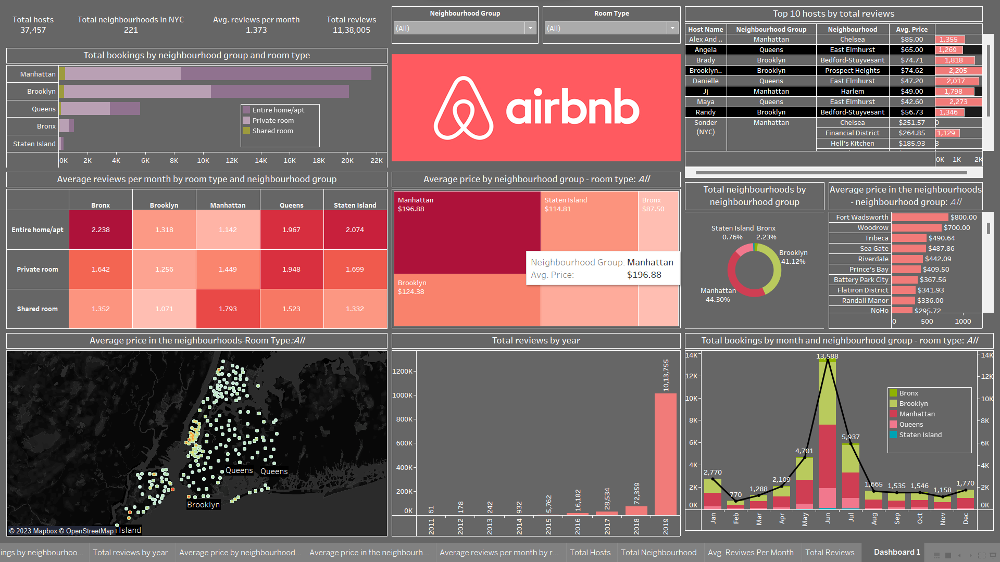

## Airbnb-NYC Dashboard using Tableau

Airbnb (ABNB) is an online marketplace that connects people who want to rent out their homes with people looking for accommodations in specific locales. The company has come a long way since 2007, when its co-founders first came up with the idea to invite paying guests to sleep on an air mattress in their living room. According to Airbnb's latest data, it now has more than 7 million listings, covering some 100,000 cities and towns in 220-plus countries and regions worldwide.

